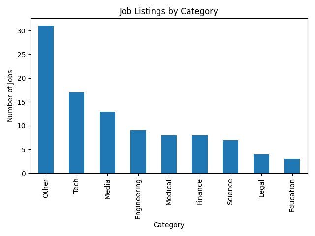

# Job Listings Scraper

A Python script that scrapes job listings from the [Fake Python Jobs](https://realpython.github.io/fake-jobs/) website, saves them to a CSV file, and analyzes the results by job category.

Built as a learning project from [roadmap.sh](https://roadmap.sh/projects/job-listings-scraper).

## What It Does

- Scrapes 100 job listings, extracting job title, company, location, and apply link
- Handles missing data gracefully
- Saves results to a CSV file
- Categorizes jobs (Tech, Medical, Finance, Engineering, etc.)
- Generates a bar chart showing the breakdown



## Setup
```bash
git clone https://github.com/YOUR_USERNAME/job-listings-scraper.git
cd job-listings-scraper
pip install -r requirements.txt
```

## Usage

Scrape the job listings:
```bash
python scraper.py
```

Analyze and chart the results:
```bash
python analyze.py
```

## Technologies

- **Requests** — fetches the webpage
- **Beautiful Soup 4** — parses HTML and extracts data
- **pandas** — processes and groups the data
- **matplotlib** — generates the bar chart

## License

[MIT](LICENSE)
